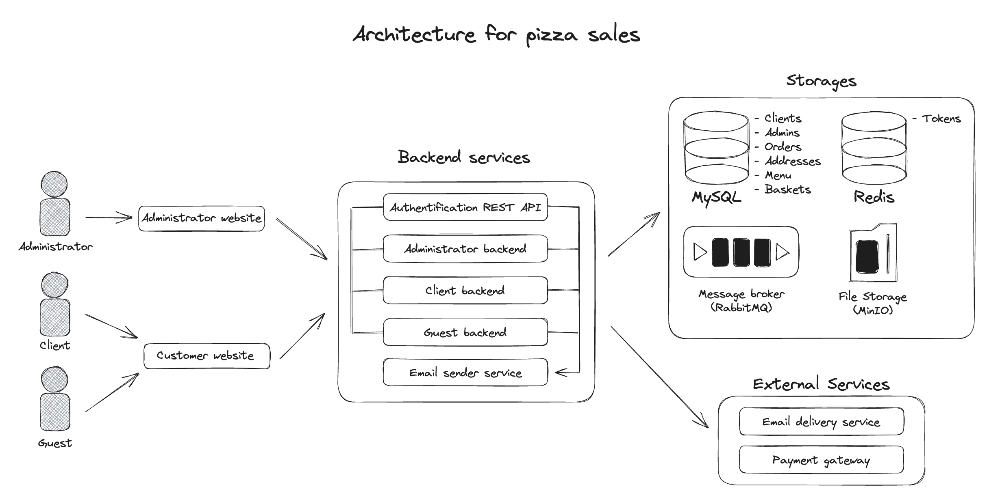
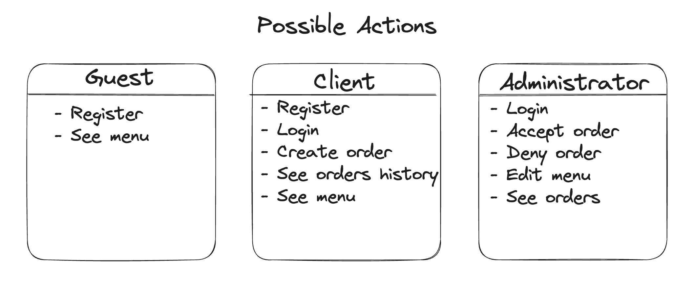

# Pizza sales 

Prototype of a pizza selling website for [lad academy](https://lad-academy.ru/main). \
The stack used: PHP/Laravel, MySQL.

[](/LICENSE)

# Table of contents

- [Documentation](#documentation)
  - [Architecture](#architecture)
  - [Possible actions for roles](#possible-actions-for-roles)
  - [Database](#database)
  - [REST API](#rest-api)
    - [Authorization REST API](#authorization-rest-api)
    - [Administration REST API](#administration-rest-api)
    - [Customer REST API](#customer-rest-api)
  - [Structure of project](#structure-of-project)
  - [Demonstration of the work](#demonstration-of-the-work)
  - - [Registration](#registration)
  - - [Login](#login)
  - - [Add products to basket](#add-products-to-basket)
  - - [Create the order](#create-the-order)
  - - [End the current session (Exit)](#end-the-current-session--exit-)
- [License](#license)

# Documentation

## Architecture



[🔝Table of contents](#table-of-contents)


## Possible actions for roles



[🔝Table of contents](#table-of-contents)


## Database


[🔝Table of contents](#table-of-contents)


## REST API

### Authorization REST API

```php
POST /register

Request body: 
{
    name, mail, phone, birthdate
}

Response:
- 201, {id} // OK
- 400 // Error
- 500 // Unexpected error
{
    error_message: $message
}
```

```php
POST /login

Request body: 
{
    login, password
}

Response:
- 200, {token, expiration} // OK
- 400 // Error
- 500 // Unexpected error
{
    error_message: $message
}
```

### Administration REST API

```php
GET /order?status=active/complete/denied

Header:
- x-auth-token: $token

Response:
- 200 // OK
- 400 // Error
- 401 // Access denied
- 403 // Forbidden 
- 500 // Unexpected error

Response body:
{
  orders: [
    {
        id, 
        payment_method, 
        delivery_method, 
        comment, 
        address, 
        status, 
        timestamp_create, 
        timestamp_accept_deny,
        items: [
            id,
            quantity,
            price,
            menu_item: {
                title,
                description,
                price,
                image
            }
        ]        
    }
      ]
      page_current: 0,
      page_count: 10
}
```

```php
POST /order/${id}

Header:
- x-auth-token: $token

Request body: 
{
    order_action: deny/accept/complete
}

Response:
- 200 // OK
- 400 // Error
- 401 // Access denied
- 403 // Forbidden 
- 404 // The order doesn't exist
- 500 // Unexpected error

Responce body:
{
    id, 
    payment_method, 
    delivery_method, 
    comment, 
    address, 
    status, 
    timestamp_create, 
    timestamp_accept_deny,
    items: [
        id,
        quantity,
        price,
        menu_item: {
            title,
            description,
            price,
            image
        }
    ]        
}
```


### Customer REST API

```php
GET /menu

Header:
- x-auth-token: $token

Response:
- 200 // OK
- 401 // Access denied
- 400 // Error
- 500 // Unexpected error

Response Body:
{
    menu: [
        {
            id, 
            title,
            description,
            price,
            image,
            timestamp    
        }
    ]
    page_current: 0,
    page_count: 10
}
```

```php
GET /menu/${id}

Header:
- x-auth-token: $token

Response:
- 200 // OK
- 401 // Access denied
- 400 // Error
- 500 // Unexpected error

Response Body:
{
    item: {
            id, 
            title,
            description,
            price,
            image,
            category,
            composition,
            calories,
            timestamp    
        }
    page_current: 0,
    page_count: 10
}
```

```php
GET /orders

Header:
- x-auth-token: $token

Response:
- 200 // OK
- 401 // Access denied
- 400 // Error
- 500 // Unexpected error

Response Body:
{
    orders: [
        {
            id, 
            payment_method, 
            delivery_method, 
            comment, 
            address, 
            status, 
            timestamp_create, 
            timestamp_accept_deny,
            items: [
                id,
                quantity,
                price,
                menu_item: {
                    title,
                    description,
                    price,
                    image
                }
            ]        
        }
    ]
    page_current: 0,
    page_count: 10
}
```

```php
GET /orders/${id}

Header:
- x-auth-token: $token

Response:
- 200 // OK
- 400 // Error
- 401 // Access denied
- 404 // The order doesn't exist
- 500 // Unexpected error

Response Body:
{
    id, 
    payment_method, 
    delivery_method, 
    comment, 
    address, 
    status, 
    timestamp_create, 
    timestamp_accept_deny,
    items: [
        id,
        quantity,
        price,
        menu_item: {
            title,
            description,
            price,
            image
        }
    ]        
}
```

```php
GET /basket

Header:
- x-auth-token: $token

Response:
- 200 // OK
- 401 // Access denied
- 400 // Error
- 500 // Unexpected error

Response Body:
{
    orders: [
        {
            id, 
            payment_method, 
            delivery_method, 
            comment, 
            address, 
            status, 
            timestamp_create, 
            timestamp_accept_deny,
            items: [
                id,
                quantity,
                price,
                menu_item: {
                    title,
                    description,
                    price,
                    image
                }
            ]        
        }
    ]
    page_current: 0,
    page_count: 10
}
```

```php
GET /basket-add/${id}

Header:
- x-auth-token: $token

Response:
- 201 // OK
- 400 // Error
- 401 // Access denied
- 404 // The order doesn't exist
- 500 // Unexpected error

Response Body:
{
    id, 
    basket_id,
    menu_item_id,
    timestamp       
}
```

```php
POST /basket/order-add

Header:
- x-auth-token: $token

Response:
- 201 // OK
- 400 // Error
- 401 // Access denied
- 404 // The order doesn't exist
- 500 // Unexpected error

Request body: 
{
    payment_method, delivery_method, comment, address, 
    items: [
        quantity,
        price,
        menu_item: {
            title,
            description,
            price,
            image
        }
    ]    
}
```

```php
GET /basket-delete/${id}

Header:
- x-auth-token: $token

Response:
- 200 // OK
- 400 // Error
- 401 // Access denied
- 404 // The order doesn't exist
- 500 // Unexpected error

Request Body:
{
    basket_id,
    menu_item_id,    
}
```

```php
GET /logout

Header:
- x-auth-token: $token

Response:
- 200 // OK
- 500 // Unexpected error
```

[🔝Table of contents](#table-of-contents)


# Structure of project
### Models
```
pizza-sales
|-app
  |-Models
```

### Views
```
pizza-sales
|-resources
  |-views
    |-includes
    |-layouts
```

### Controllers
```
pizza-sales
|-app
  |-Http
    |-Controllers
```

### Routes
```
pizza-sales
|-routes
  |-web.php
```

### Databases
```
pizza-sales
|-database
  |-migrations
```
        

[🔝Table of contents](#table-of-contents)

# Demonstration of the work

## Registration


## Login


## Add products to basket


## Create the order


## End the current session (Exit)


[🔝Table of contents](#table-of-contents)

# License
`pizza-sales` is distributed under the [MIT License](https://github.com/Tsygankov-Slava/pizza-sales/blob/main/LICENSE), on behalf of Tsygankov Viacheslav.

[🔝Table of contents](#table-of-contents)
